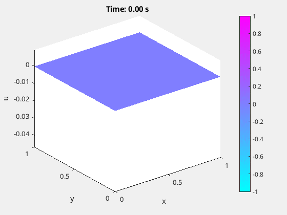

# Learning tissue deformation dynamics

<p align="center">
  
</p>

## Project overview

The goal of the project is to use Physics Informed Neural Networks to learn the dybamics of a vibrating tissue.

The following steps have been carried out to complete the task:

- ### Mathematical Formulation  
  Model and normalize the Partial Differential Equation representing the physical phenomenom;
- ### Constraints and External Force
  Represent the expressions of the hard constraints, i.e. the boundary conditions, to whom the PDE is subject and the external force acting on the membrane;
- ### Neural Network Architecture
  Choose an architecture to build the PINN. We compared a simple MLP, an MLP with Random Weight Factorization (RWF) and a Kolmogorov-Arnold Network (KAN);
- ### Data validation
  We validated the predictions of the networks by comparing them to an ideal membrane deformation built using Matlab's pde solver.

## How to run the code

To start a training, run  
```bash
python main.py [network] [activation function] [training setup] [optional: regularization]
```
with:
- network = __MLP__ || __RWF__ || __KAN__
- activation function = __tanh__ || __relu__ || __silu__
- training setup = __setup1__ || __setup2__
- regularization (use this only if training a KAN) = __noreg__ || __eff_reg__ || __orig_reg__

When the training is complete, the model will be saved in __/training/{model_name}_{index}/model__.  
Then:
1. Run __prediction.ipynb__, the predictions of the network will be saved in  
__/matlab/only_damp/matlab_evaluations/predictions_csv_files/{model_name}_{index}/predictions.csv__.  
You can generate a different mesh by changing and running __/matlab/only_damp/pde_only_damp_ideal.m__
2. Run __/matlab/only_damp/matlab_evaluations/single_eval.m__, specifying __{model_name}_{index}__.
It will save into __/matlab/only_damp/matlab_evaluations/{model_name}_{index}__ a gif with the predicted membrane oscillation.
3. Run __/matlab/only_damp/matlab_evaluations/membrane_error.m__.  
It will save into __/matlab/only_damp/matlab_evaluations/{model_name}_{index}__ a gif with the difference between the ideal and the predicted oscillation, along with the plots of the error with respect to the ideal solution.

## Useful resources used during development

### KAN:
- [A from-scratch implementation of Kolmogorov-Arnold Networks (KAN)…and MLP](https://mlwithouttears.com/2024/05/15/a-from-scratch-implementation-of-kolmogorov-arnold-networks-kan/)
- [Awesome KAN(Kolmogorov-Arnold Network)](https://github.com/mintisan/awesome-kan)
- [KAN: Kolmogorov-Arnold Networks - papers_with_code](https://paperswithcode.com/paper/kan-kolmogorov-arnold-networks)
- [Efficient KAN](https://github.com/Blealtan/efficient-kan)

### Vibrating Membrane:
- [Vibrations of Rectangular Membranes](https://math.libretexts.org/Bookshelves/Differential_Equations/Introduction_to_Partial_Differential_Equations_(Herman)/06%3A_Problems_in_Higher_Dimensions/6.01%3A_Vibrations_of_Rectangular_Membranes)
- [Higher-dimensional PDEs](https://links.uwaterloo.ca/amath353docs/set8.pdf)
- [Wave equation](https://en.wikipedia.org/wiki/Wave_equation)

### Random Weight Factorization 
- [RANDOM WEIGHT FACTORIZATION IMPROVES THE TRAINING OF CONTINUOUS NEURAL REPRESENTATIONS](https://arxiv.org/pdf/2210.01274)

### Early Stopping
- [Early stopping](https://github.com/Bjarten/early-stopping-pytorch)

## Authors
- Matteo Carnebella
- Michael Corelli
- Francesco Di Lorenzo
